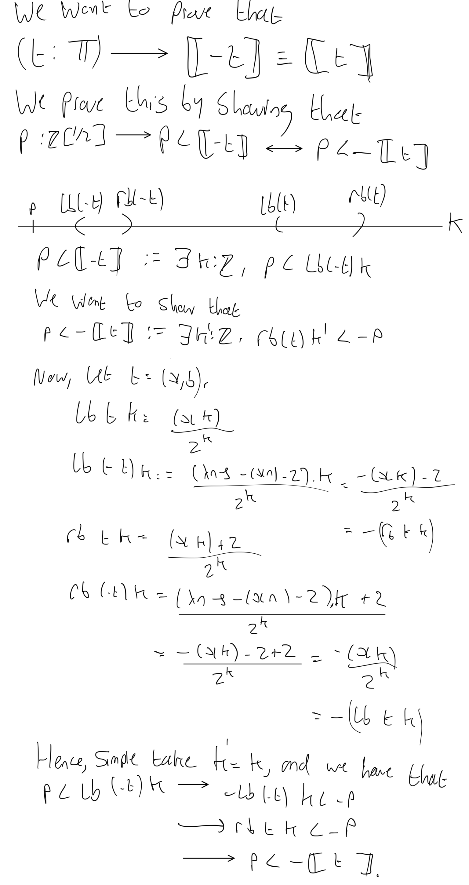

This file proves that the ternary Boehm reals are embedded in the
Dedekind reals defined using subsets of dyadic rationals.

```agda

{-# OPTIONS --allow-unsolved-metas #-}

open import SpartanMLTT renaming (_+_ to _∔_)
open import CanonicalMapNotation
open import OrderNotation
open import IntegersB
open import IntegersAddition
open import IntegersOrder
open import IntegersMultiplication
open import NaturalsAddition renaming (_+_ to _+ℕ_)
open import NaturalsMultiplication renaming (_*_ to _*ℕ_)
open import IntegersNegation
open import UF-Base
open import UF-FunExt
open import UF-Powerset hiding (𝕋)
open import UF-PropTrunc
open import UF-Subsingletons

module Todd.TBRDyadicReals
  (pt : propositional-truncations-exist)
  (fe : FunExt)
  (pe : PropExt)
 where

open import Todd.BelowAndAbove fe using (below-implies-below' ; _below'_ ; below'-implies-below)
open import Todd.DyadicReals pt fe
open import Todd.RationalsDyadic fe
open import Todd.TernaryBoehmRealsPrelude fe
open import Todd.TernaryBoehmReals fe pe hiding (ι)

open PropositionalTruncation pt
module _
  (DyOrPr : OrderProperties)
 where
 
 open OrderProperties DyOrPr
 open DyadicProperties Dp

```

The following defines machinery to obtain the interval representations
of a ternary Boehm object at each layer n.

```agda

 brick_on-level_ : ℤ → ℤ → ℤ[1/2] × ℤ[1/2]
 brick k on-level n = (normalise (k , n)) , (normalise (succℤ (succℤ k) , n))

 encoding_at-level_ : 𝕋 → ℤ → ℤ[1/2] × ℤ[1/2]
 encoding (x , _) at-level n = brick (x n) on-level n

 lb rb : 𝕋 → ℤ → ℤ[1/2]
 lb t n = pr₁ (encoding t at-level n)
 rb t n = pr₂ (encoding t at-level n)

 disjoint-lemma : (t : 𝕋) → (i j : ℤ) → lb t i < rb t j
 disjoint-lemma t i j = {!!}

 located-lemma₁ : (p q l r : ℤ[1/2]) → (r ℤ[1/2]- l) < (q ℤ[1/2]- p)
                → (p < l) ∔ (r < q)
 located-lemma₁ = {!!}

 located-lemma₂ : (t : 𝕋) → (p : ℤ[1/2]) → 0ℤ[1/2] < p
                → ∃ k ꞉ ℤ , (rb t k ℤ[1/2]- lb t k) < p
 located-lemma₂ = {!!}

 _⊂_ : ℤ[1/2] × ℤ[1/2] → ℤ[1/2] × ℤ[1/2] → 𝓤₀ ̇ 
 (a , b) ⊂ (c , d) = ((c ≤ a) × (d < b))
                   ∔ ((c < a) × (d ≤ b))

-- encoding-structural : (x : 𝕋) → (n : ℤ)
--                     → (encoding x at-level (succℤ n)) ⊂ (encoding x at-level n)
-- encoding-structural (x , b) n = {!!}

```

A dyadic rational p is on the left of the dyadic real K if there
exists some level k for which the rational is below the left side of
the interval of K on level k.  Similarly, q is on the right of K if
there exists a level k for which the rational is above the right side
of the interval of K on level k.

Left inhabitedness follows easily by identifying the left interval of
some layer of k. Choose 0 for simplicity.  Right inhabitedness follows
similarly.

Roundedness follows easily from denseness of ℤ[1/2], and transtivity of order.

Disjointedness is more difficult, and relies on a lemma which says
that the left side of any brick in the sequence defined by a Ternary
Boehm Real is smaller the the right side of any brick in the sequence.

Locatedness is fairly trivial since the intervals defined by the TBR
get smaller on higher levels, and it easy to locate intervals of
different sizes.

```agda

 _ : 𝕋 → ℝ-d
  x , b  = (L , R) , inhabited-L , inhabited-R , rounded-L , rounded-R , is-disjoint , is-located
  where
   L R : 𝓟 ℤ[1/2]
   L p = (∃ k ꞉ ℤ , p < lb (x , b) k) , ∃-is-prop
   R q = (∃ k ꞉ ℤ , rb (x , b) k < q) , ∃-is-prop
   
   inhabited-L : inhabited-left L
   inhabited-L = let (m , m<l) = no-min (lb (x , b) (pos 0))
                 in ∣ m , ∣ (pos 0) , m<l ∣ ∣
   inhabited-R : inhabited-right R
   inhabited-R = let (m , r<m) = no-max (rb (x , b) (pos 0))
                 in ∣ m , ∣ pos 0 , r<m ∣  ∣

   rounded-L : rounded-left L
   rounded-L p = left-implication , right-implication
    where  
     left-implication : ∃ k ꞉ ℤ , p < lb (x , b) k
                      → ∃ z ꞉ ℤ[1/2] , p < z × (∃ k' ꞉ ℤ , z < lb (x , b) k')
     left-implication  = ∥∥-functor I
      where
       I : Σ k ꞉ ℤ , p < lb (x , b) k
         → Σ z ꞉ ℤ[1/2] , p < z × (∃ k' ꞉ ℤ , z < lb (x , b) k')
       I (k , p<l) = let (m , p<m , m<l) = dense p (lb (x , b) k)
                     in m , p<m , ∣ k , m<l ∣
     right-implication : ∃ z ꞉ ℤ[1/2] , p < z × (∃ k' ꞉ ℤ , z < lb (x , b) k')
                       → ∃ k ꞉ ℤ , p < lb (x , b) k
     right-implication = ∥∥-rec ∃-is-prop I
      where
       I : Σ z ꞉ ℤ[1/2] , p < z × (∃ k' ꞉ ℤ , z < lb (x , b) k')
         → ∃ k ꞉ ℤ , p < lb (x , b) k
       I (z , p<z , z<l) = ∥∥-functor II z<l
        where
         II : Σ k' ꞉ ℤ , z < lb (x , b) k'
            → Σ k ꞉ ℤ , p < lb (x , b) k
         II (k , z<l) = k , trans p z (lb (x , b) k) p<z z<l 

   rounded-R : rounded-right R
   rounded-R q = left-implication , right-implication
    where
     left-implication : ∃ k ꞉ ℤ , rb (x , b) k < q
                      → ∃ z ꞉ ℤ[1/2] , z < q × (∃ k' ꞉ ℤ , rb (x , b) k' < z)
     left-implication = ∥∥-functor I
      where
       I : Σ k ꞉ ℤ , rb (x , b) k < q
         → Σ z ꞉ ℤ[1/2] , z < q × (∃ k' ꞉ ℤ , rb (x , b) k' < z)
       I (k , r<z) = let (m , r<m , m<q) = dense (rb (x , b) k) q
                     in m , m<q , ∣ k , r<m ∣
     right-implication : ∃ z ꞉ ℤ[1/2] , z < q × (∃ k' ꞉ ℤ , rb (x , b) k' < z)
                       → ∃ k ꞉ ℤ , rb (x , b) k < q 
     right-implication = ∥∥-rec ∃-is-prop I
      where
       I : Σ z ꞉ ℤ[1/2] , z < q × (∃ k' ꞉ ℤ , rb (x , b) k' < z)
         → ∃ k ꞉ ℤ , rb (x , b) k < q
       I (z , z<q , r<z) = ∥∥-functor II r<z
        where
         II : Σ k' ꞉ ℤ , rb (x , b) k' < z
            → Σ k ꞉ ℤ , rb (x , b) k < q
         II (k , r<z) = k , trans (rb (x , b) k) z q r<z z<q
      
   is-disjoint : disjoint L R
   is-disjoint p q (p<l , r<q) = I (binary-choice p<l r<q)
    where
     I : ∥ (Σ k ꞉ ℤ , p < lb (x , b) k)
         × (Σ k' ꞉ ℤ , rb (x , b) k' < q) ∥
       → p < q
     I = ∥∥-rec (<ℤ[1/2]-is-prop p q) II
      where
       II : (Σ k ꞉ ℤ , p < lb (x , b) k)
          × (Σ k' ꞉ ℤ , rb (x , b) k' < q)
          → p < q
       II ((k , p<l) , k' , r<q) = trans₂ p l r q p<l l<r r<q
        where
         l = lb (x , b) k
         r = rb (x , b) k'
         l<r = disjoint-lemma (x , b) k k'

   is-located : located L R
   is-located p q p<q = ∥∥-rec ∨-is-prop I (located-lemma₂ (x , b) (q ℤ[1/2]- p) (diff-positive p q p<q ))
    where
     I : Σ k ꞉ ℤ , ((rb (x , b) k) ℤ[1/2]- (lb (x , b) k)) < (q ℤ[1/2]- p)
       → (L p holds) ∨ (R q holds)
     I (k , less) with located-lemma₁ p q (lb (x , b) k) (rb (x , b) k) less
     ... | inl p<l = ∣ inl ∣ k , p<l ∣ ∣
     ... | inr r<q = ∣ inr ∣ k , r<q ∣ ∣
                        
```

want to prove that (x : ℤ[1/2]) →  map x  ≡ ι x

We now wish to introduce the map from encodings to TBR's : ℤ[1/2] → 𝕋.
The intuition behind the map is that ... 

```agda

 layer : ℤ[1/2] → ℕ
 layer ((_ , n) , _) = n
 
 map : ℤ[1/2] → 𝕋
 map ((k , δ) , _) = build-via (k , pos δ)

 normalise-pos-lemma₁ : (k : ℤ) (δ : ℕ) (p : (δ ≡ 0) ∔ ((δ ≢ 0) × odd k))
              → normalise-pos ((k + k) /2') δ ≡ (k , δ) , p
 normalise-pos-lemma₁ k 0 (inl refl) = to-subtype-≡ (λ (z , n) → ℤ[1/2]-cond-is-prop z n) (to-×-≡ (div-by-two k) refl)
 normalise-pos-lemma₁ k 0 (inr (δnz , k-odd)) = 𝟘-elim (δnz refl)
 normalise-pos-lemma₁ k (succ δ) (inr p) with even-or-odd? ((k + k) /2')
 normalise-pos-lemma₁ k (succ δ) (inr (δnz , k-odd)) | inl k-even = 𝟘-elim (k-even (transport odd (div-by-two k ⁻¹) k-odd))
 ... | inr _ = to-subtype-≡ (λ (z , n) → ℤ[1/2]-cond-is-prop z n) (to-×-≡ (div-by-two k) refl)

 normalise-pos-lemma₂ : (k : ℤ) (δ : ℕ) → normalise-pos k δ ≡ normalise-pos (k + k) (succ δ)
 normalise-pos-lemma₂ k δ with even-or-odd? (k + k)
 ... | inl _ = ap (λ s → normalise-pos s δ) (div-by-two k ⁻¹)
 ... | inr o = 𝟘-elim (times-two-even' k o)
 
 normalise-lemma : (k : ℤ) (δ : ℕ) (n : ℕ) (p : (δ ≡ 0) ∔ ((δ ≢ 0) × odd k))
                 → normalise (rec k downLeft n + rec k downLeft n , (pos (succ δ) + pos n)) ≡ (k , δ) , p
 normalise-lemma k δ 0 p with even-or-odd? (k + k)
 ... | inl even = normalise-pos-lemma₁ k δ p
 ... | inr odd = 𝟘-elim (times-two-even' k odd)
 normalise-lemma k δ (succ n) p with even-or-odd? (k + k)
 ... | inl even = let y = rec k downLeft n 
                      z = (y + y) in 
                  normalise (z + z , (succℤ (pos (succ δ) + pos n))) ≡⟨ ap (λ - → normalise (z + z , succℤ -)) (pos-addition-equiv-to-ℕ (succ δ) n) ⟩
                  normalise (z + z , succℤ (pos (succ δ +ℕ n)))      ≡⟨ refl ⟩
                  normalise-pos (z + z) (succ (succ δ +ℕ n))         ≡⟨ normalise-pos-lemma₂ z (succ δ +ℕ n) ⁻¹ ⟩
                  normalise-pos z (succ δ +ℕ n)                      ≡⟨ refl ⟩
                  normalise (z , pos (succ δ +ℕ n))                  ≡⟨ ap (λ - → normalise (z , -)) (pos-addition-equiv-to-ℕ (succ δ) n ⁻¹) ⟩
                  normalise (z , pos (succ δ) + pos n)               ≡⟨ normalise-lemma k δ n p ⟩
                  (k , δ) , p ∎ 
 ... | inr odd = 𝟘-elim (times-two-even' k odd)
 
 lowest-terms-normalised : (((k , δ) , p) : ℤ[1/2]) → normalise-pos k δ ≡ ((k , δ) , p)
 lowest-terms-normalised ((k , .0) , inl refl) = refl
 lowest-terms-normalised ((k , zero) , inr (δnz , k-odd)) = 𝟘-elim (δnz refl)
 lowest-terms-normalised ((k , succ δ) , inr (δnz , k-odd)) with even-or-odd? k
 ... | inl k-even = 𝟘-elim (k-even k-odd)
 ... | inr k-odd = to-subtype-≡ (λ (z , n) → ℤ[1/2]-cond-is-prop z n) refl

 map-lemma : (z : ℤ[1/2]) → (i : ℤ) → pos (layer z) < i → lb (map z) i ≡ z
 map-lemma ((k , δ) , p) i δ<i with ℤ-trichotomous i (pos δ)
 ... | inl i<δ       = 𝟘-elim (ℤ-equal-not-less-than i (ℤ<-trans i (pos δ) i i<δ δ<i))
 ... | inr (inl i≡δ) = 𝟘-elim (ℤ-equal-not-less-than i (transport (_< i) (i≡δ ⁻¹) δ<i))
 ... | inr (inr (n , refl)) with even-or-odd? (downLeft k)
 ... | inr odd-2k = 𝟘-elim (times-two-even' k odd-2k)
 map-lemma ((k , δ) , p) i δ<i | inr (inr (n , refl)) | inl even-2k = normalise-lemma k δ n p

 map-lemma-≤ : (z : ℤ[1/2]) → (i : ℤ) → pos (layer z) ≤ i → lb (map z) i ≡ z
 map-lemma-≤ ((k , δ) , p) i δ≤i with ℤ≤-split (pos δ) i δ≤i
 ... | inl δ<i = map-lemma ((k , δ) , p) i δ<i
 ... | inr refl with ℤ-trichotomous (pos δ) (pos δ)
 ... | inl δ<δ = 𝟘-elim (ℤ-equal-not-less-than (pos δ) δ<δ)
 ... | inr (inr δ<δ) = 𝟘-elim (ℤ-equal-not-less-than (pos δ) δ<δ)
 ... | inr (inl δ≡δ) = to-subtype-≡ (λ (z , n) → ℤ[1/2]-cond-is-prop z n) (ap pr₁ (lowest-terms-normalised ((k , δ) , p)))

 -- normalise-pos
 normalise-≤ : ((k , δ) : ℤ × ℕ) → ((m , ε) : ℤ × ℕ)
             → k * pos (2^ ε) ≤ m * pos (2^ δ)
             → normalise (k , pos δ) ≤ normalise (m , pos ε)
 normalise-≤ (k , δ) (m , ε) l with normalise-pos' k δ , normalise-pos' m ε
 ... | (n₁ , e₁) , (n₂ , e₂) = let (((k' , δ') , p) , ((m' , ε') , p')) = (normalise-pos k δ , normalise-pos m ε) in 
  ℤ≤-ordering-right-cancellable
   (k' * pos (2^ ε'))
    (m' * pos (2^ δ'))
     (pos (2^ (n₁ +ℕ n₂)))
      (power-of-pos-positive (n₁ +ℕ n₂))
       (transport₂ _≤_ (I k ε k' ε' n₁ n₂ (pr₁ (from-×-≡' e₁) ⁻¹) (pr₂ (from-×-≡' e₂) ⁻¹))
                       ((I m δ m' δ' n₂ n₁ (pr₁ (from-×-≡' e₂) ⁻¹) (pr₂ (from-×-≡' e₁) ⁻¹))
                        ∙ ap (λ z → m' * pos (2^ δ') * pos (2^ z)) (addition-commutativity n₂ n₁)) l)
   where
    k' = pr₁ (pr₁ (normalise-pos k δ))
    δ' = pr₂ (pr₁ (normalise-pos k δ))
    m' = pr₁ (pr₁ (normalise-pos m ε))
    ε' = pr₂ (pr₁ (normalise-pos m ε))
    I : (k : ℤ) (ε : ℕ) (k' : ℤ) (ε' : ℕ) (n₁ n₂ : ℕ) → k ≡ pos (2^ n₁) * k' → ε ≡ ε' +ℕ n₂ → k * pos (2^ ε) ≡ k' * pos (2^ ε') * pos (2^ (n₁ +ℕ n₂))
    I k ε k' ε' n₁ n₂ e₁ e₂ =
        k * pos (2^ ε)                            ≡⟨ ap (_* pos (2^ ε)) e₁ ⟩
        pos (2^ n₁) * k' * pos (2^ ε)             ≡⟨ ap (_* pos (2^ ε)) (ℤ*-comm (pos (2^ n₁)) k') ⟩
        k' * pos (2^ n₁) * pos (2^ ε)             ≡⟨ ap (λ z → k' * pos (2^ n₁) * pos (2^ z)) e₂ ⟩
        k' * pos (2^ n₁) * pos (2^ (ε' +ℕ n₂))    ≡⟨ ℤ*-assoc k' (pos (2^ n₁)) (pos (2^ (ε' +ℕ n₂))) ⟩
        k' * (pos (2^ n₁) * pos (2^ (ε' +ℕ n₂)))  ≡⟨ ap (k' *_) (pos-multiplication-equiv-to-ℕ (2^ n₁) (2^ (ε' +ℕ n₂))) ⟩
        k' * pos ((2^ n₁) *ℕ 2^ (ε' +ℕ n₂))       ≡⟨ ap (λ z →  k' * pos ((2^ n₁) *ℕ z)) (prod-of-powers 2 ε' n₂ ⁻¹) ⟩
        k' * pos (2^ n₁ *ℕ (2^ ε' *ℕ 2^ n₂))      ≡⟨ ap (λ z → k' * pos z) (mult-associativity (2^ n₁) (2^ ε') (2^ n₂) ⁻¹) ⟩
        k' * pos (2^ n₁ *ℕ 2^ ε' *ℕ 2^ n₂)        ≡⟨ ap (λ z → k' * pos (z *ℕ 2^ n₂)) (mult-commutativity (2^ n₁) (2^ ε')) ⟩
        k' * pos (2^ ε' *ℕ 2^ n₁ *ℕ 2^ n₂)        ≡⟨ ap (λ z → k' * pos z) (mult-associativity (2^ ε') (2^ n₁) (2^ n₂)) ⟩
        k' * pos (2^ ε' *ℕ (2^ n₁ *ℕ 2^ n₂))      ≡⟨ ap (λ z → k' * z) (pos-multiplication-equiv-to-ℕ (2^ ε') (2^ n₁ *ℕ 2^ n₂) ⁻¹) ⟩
        k' * (pos (2^ ε') * pos (2^ n₁ *ℕ 2^ n₂)) ≡⟨ ap (λ z → k' * (pos (2^ ε') * pos z)) (prod-of-powers 2 n₁ n₂) ⟩
        k' * (pos (2^ ε') * pos (2^ (n₁ +ℕ n₂)))  ≡⟨ ℤ*-assoc k' (pos (2^ ε')) (pos (2^ (n₁ +ℕ n₂))) ⁻¹ ⟩
        k' * pos (2^ ε') * pos (2^ (n₁ +ℕ n₂))    ∎

 normalise-neg' : (x : ℤ) (a : ℕ) → let ((k , δ) , p) = normalise-neg x a
                                    in (k , δ) ≡ pos (2^ (succ a)) * x , 0
 normalise-neg' x 0        = to-×-≡ (ℤ*-comm x (pos 2)) refl
 normalise-neg' x (succ a) with from-×-≡' (normalise-neg' (x + x) a)
 ... | e₁ , e₂ = to-×-≡ I e₂
  where
   I : pr₁ (pr₁ (normalise-neg (x + x) a)) ≡ pos (2^ (succ (succ a))) * x
   I = pr₁ (pr₁ (normalise-neg (x + x) a)) ≡⟨ e₁ ⟩
       pos (2^ (succ a)) * (x * pos 2)     ≡⟨ ap (pos (2^ (succ a)) *_) (ℤ*-comm x (pos 2)) ⟩
       pos (2^ (succ a)) * (pos 2 * x)     ≡⟨ ℤ*-assoc (pos (2^ (succ a))) (pos 2) x ⁻¹ ⟩
       pos (2^ (succ a)) * pos 2 * x       ≡⟨ ap (_* x) (pos-multiplication-equiv-to-ℕ (2^ (succ a)) 2) ⟩
       pos (2^ (succ a) *ℕ 2) * x          ≡⟨ ap (λ z → pos z * x) (mult-commutativity (2^ (succ a)) 2) ⟩
       pos (2^ (succ (succ a))) * x ∎
 
 -- normalise-neg
 normalise-≤' : ((k , δ) : ℤ × ℕ) → ((m , ε) : ℤ × ℕ)
             → k * pos (2^ (succ δ)) ≤ m * pos (2^ (succ ε))
             → normalise (k , negsucc δ) ≤ normalise (m , negsucc ε)
 normalise-≤' (k , δ) (m , ε) with (from-×-≡' (normalise-neg' k δ) , from-×-≡' (normalise-neg' m ε))
 ... | ((e₁ , e₂) , e₃ , e₄) = transport₂ _≤_
                                (ℤ*-comm k (pos (2^ (succ δ))) ∙ ap₂ (λ z z' → z * pos (2^ z')) (e₁ ⁻¹) (e₄ ⁻¹))
                                 (ℤ*-comm m (pos (2^ (succ ε))) ∙ ap₂ (λ z z' → z * pos (2^ z')) (e₃ ⁻¹) (e₂ ⁻¹))

 lim₁ : (x : ℤ) → (n : ℕ) → x * pos (2^ (succ n)) ≤ (x * pos 2) * pos (2^ n) 
 lim₁ x n = 0 , (x * pos (2^ (succ n))    ≡⟨ ap (x *_) (pos-multiplication-equiv-to-ℕ 2 (2^ n) ⁻¹) ⟩
                 x * (pos 2 * pos (2^ n)) ≡⟨ ℤ*-assoc x (pos 2) (pos (2^ n)) ⁻¹ ⟩
                 x * pos 2 * pos (2^ n)   ∎)

 lim₂ : (x : ℤ) → (n : ℕ) → x * pos (2^ (succ n)) ≤ (x * pos 2 + pos 1) * pos (2^ n) 
 lim₂ x n = ℤ≤-trans _ _ _ (lim₁ x n) (positive-multiplication-preserves-order' _ _ (pos (2^ n)) (power-of-pos-positive n) (≤-incrℤ (x * pos 2)))

 lim₃ : (x : ℤ) → (n : ℕ) → x * pos (2^ (succ n)) ≤ (x * pos 2 + pos 2) * pos (2^ n) 
 lim₃ x n = ℤ≤-trans _ _ _ (lim₂ x n) (positive-multiplication-preserves-order' _ _ (pos (2^ n)) (power-of-pos-positive n) (≤-incrℤ (succℤ (x * pos 2))))

 lim₄ : (x' x : ℤ) (n : ℕ) → x' below' x → x * pos (2^ (succ n)) ≤ x' * pos (2^ n)
 lim₄ x' x n (inl x'≡2x)         = transport (λ z → x * pos (2^ (succ n)) ≤ z * pos (2^ n)) (x'≡2x ⁻¹) (lim₁ x n) 
 lim₄ x' x n (inr (inl x'≡2x+1)) = transport (λ z → x * pos (2^ (succ n)) ≤ z * pos (2^ n)) (x'≡2x+1 ⁻¹) (lim₂ x n)
 lim₄ x' x n (inr (inr x'≡2x+2)) = transport (λ z → x * pos (2^ (succ n)) ≤ z * pos (2^ n)) (x'≡2x+2 ⁻¹) (lim₃ x n)

 left-interval-monotonic' : (t : 𝕋) → (n : ℤ) → lb t n ≤ lb t (succℤ n)
 left-interval-monotonic' (x , b) (pos n) = normalise-≤ ((x (pos n)) , n) (x (pos (succ n)) , succ n)
                                   (lim₄ (x (pos (succ n))) (x (pos n)) n
                                    (below-implies-below' (x (pos (succ n))) (x (pos n)) (b (pos n))))
 left-interval-monotonic' (x , b) (negsucc 0) with below-implies-below' (x (pos 0)) (x (negsucc 0)) (b (negsucc 0))
 ... | inl e = 0 , (e ⁻¹)
 ... | inr (inl e) = 1 , (e ⁻¹)
 ... | inr (inr e) = 2 , (e ⁻¹)
 left-interval-monotonic' (x , b) (negsucc (succ n)) = normalise-≤' (x (negsucc (succ n)) , (succ n)) (x (negsucc n) , n)
                                                        (lim₄ (x (negsucc n)) (x (negsucc (succ n))) (succ n)
                                                         (below-implies-below' (x (negsucc n)) (x (negsucc (succ n))) (b (negsucc (succ n)))))
 
 left-interval-monotonic : (x : ℤ[1/2]) → (n : ℤ) → lb (map x) n ≤ lb (map x) (succℤ n)
 left-interval-monotonic x n = left-interval-monotonic' (map x) n
                               
 left-interval-is-minimum-lemma : (x : ℤ[1/2]) → (n : ℤ) (m : ℕ) → succℤ n + pos m ≡ pos (layer x) → lb (map x) n ≤ x 
 left-interval-is-minimum-lemma x n 0 e = transport (lb (map x) n ≤_) I II
  where
   I : lb (map x) (succℤ n) ≡ x
   I = map-lemma-≤ x (succℤ n) (0 , (e ⁻¹))
   II : lb (map x) n ≤ lb (map x) (succℤ n)
   II = left-interval-monotonic x n
 left-interval-is-minimum-lemma x n (succ m) e = trans' (lb (map x) n) (lb (map x) (succℤ n)) x (left-interval-monotonic x n) I
  where
   I : lb (map x) (succℤ n) ≤ x
   I = left-interval-is-minimum-lemma x (succℤ n) m (ℤ-left-succ (succℤ n) (pos m) ∙ e) 

 left-interval-is-minimum : (x : ℤ[1/2]) → (n : ℤ) → lb (map x) n ≤ x
 left-interval-is-minimum ((x , δ) , p) n with ℤ-trichotomous (pos δ) n
 ... | inl δ<n = transport (_≤ ((x , δ) , p)) (map-lemma ((x , δ) , p) n δ<n ⁻¹) (≤-refl ((x , δ) , p))
 ... | inr (inl refl) = transport (_≤ ((x , δ) , p)) (map-lemma-≤ (((x , δ) , p)) n (ℤ≤-refl (pos δ)) ⁻¹) (≤-refl ((x , δ) , p))
 ... | inr (inr (m , e)) = left-interval-is-minimum-lemma (((x , δ) , p)) n m e

 encodings-agree-with-reals : (x : ℤ[1/2]) →  map x  ≡ ι x
 encodings-agree-with-reals x = ℝ-d-equality-from-left-cut left right
  where
   left : (y : ℤ[1/2]) → (∃ n ꞉ ℤ , y < lb (map x) n) → y < x
   left y = ∥∥-rec (<ℤ[1/2]-is-prop y x) λ (n , y<l) → trans<≤ y (lb (map x) n) x y<l (left-interval-is-minimum x n) 
   right : (y : ℤ[1/2]) → y < x → ∃ n ꞉ ℤ , y < lb (map x) n
   right y y<x = ∣ (pos (layer x) , (transport (y <_) (map-lemma-≤ x (pos (layer x) ) (ℤ≤-refl (pos (layer x))) ⁻¹) y<x)) ∣

```

Now, we define negation, addition and multiplication of ternary Boehm reals.

 𝕀− : (ℤ × ℤ) → (ℤ × ℤ)
 𝕀− (k , p) = ( − k − 2 , p)

 𝕋− : 𝕋 → 𝕋
 𝕋− (x , b) = (λ n → 𝕀− (x n , n)) . {!!}

We begin with negation, being the easiest operation to define.

Notice that we cannot simple take (λ n → - x n) as our new TBR precision function. 

Recall the following brick → interval definition

⟪_⟫ : ℤ × ℤ → ℚ × ℚ
⟪ k , δ ⟫ = (k / 2^{δ - 1}) , ((k + 2) / 2^{δ - 1})

where k = x (δ) for t : 𝕋 , t = (x , b).

If we define subtraction at (λ n → - x n), then we obtain that
⟪ 𝕋- (x , b) , δ ⟫ = (- k / 2^{δ - 1} , - k - 2 / 2^{δ - 1})

```agda

 𝕋- : 𝕋 → 𝕋
 𝕋- (x , b) = (λ n → predℤ (predℤ (- x n))) , below-proof
  where
   below-proof : (δ : ℤ) → predℤ (predℤ (- x (succℤ δ))) below predℤ (predℤ (- x δ))
   below-proof δ with b (x δ)
   ... | below with ℤ≤-swap₂ (x δ * pos 2) (x (succℤ δ)) (x δ * pos 2 + pos 2) (b δ) 
   ... | l₁ , l₂ = transport (_≤ℤ predℤ (predℤ (- x (succℤ δ)))) I (ℤ≤-adding' (- succℤ (succℤ (x δ + x δ))) (- x (succℤ δ)) (negsucc 1) l₂) ,
                  (transport(predℤ (predℤ (- x (succℤ δ))) ≤ℤ_) II (ℤ≤-adding' (- x (succℤ δ)) (- (x δ + x δ)) (negsucc 1) l₁))
    where
     I : (- ((x δ + x δ) + pos 2)) - pos 2 ≡ (- x δ) - pos 2 + ((- x δ) - pos 2)
     I = (- (x δ + x δ + pos 2)) - pos 2         ≡⟨ ap (λ z → (- z) - pos 2) (ℤ+-assoc (x δ) (x δ) (pos 2)) ⟩
         (- (x δ + (x δ + pos 2))) - pos 2       ≡⟨ ap (_- pos 2) (negation-dist (x δ) (x δ + pos 2) ⁻¹) ⟩
         (- x δ) + (- (x δ + pos 2)) - pos 2     ≡⟨ ap (λ z → (- x δ) + (- z) - pos 2) (ℤ+-comm (x δ) (pos 2)) ⟩
         (- x δ) + (- (pos 2 + x δ)) - pos 2     ≡⟨ ap (λ z → (- x δ) + z - pos 2) (negation-dist (pos 2) (x δ) ⁻¹) ⟩
         (- x δ) + ((- pos 2) + (- x δ)) - pos 2 ≡⟨ ap (_- pos 2) (ℤ+-assoc (- x δ) (- pos 2) (- x δ) ⁻¹) ⟩
         (- x δ) - pos 2 + (- x δ) - pos 2       ≡⟨ ℤ+-assoc ((- x δ) - pos 2) (- x δ) (- pos 2) ⟩
         (- x δ) - pos 2 + ((- x δ) - pos 2)     ∎
     II : (- (x δ + x δ)) - pos 2 ≡ ((- x δ) - pos 2) + ((- x δ) - pos 2) + pos 2
     II = (- (x δ + x δ)) - pos 2                           ≡⟨ ap (_- pos 2) (negation-dist (x δ) (x δ) ⁻¹) ⟩
          (- x δ) + (- x δ) - pos 2                         ≡⟨ ℤ+-assoc (- x δ) (- x δ) (- pos 2) ⟩
          (- x δ) + ((- x δ) - pos 2)                       ≡⟨ ap ((- x δ) +_) (ℤ+-comm (- x δ) (- pos 2)) ⟩
          (- x δ) + ((- pos 2) + (- x δ))                   ≡⟨ ℤ+-assoc (- (x δ)) (- pos 2) (- x δ) ⁻¹ ⟩
          (- x δ) - pos 2 - x δ                             ≡⟨ ap (λ z → (- x δ) - pos 2 + ((- x δ) + z)) (ℤ-sum-of-inverse-is-zero' (pos 2) ⁻¹) ⟩
          (- x δ) - pos 2 + ((- x δ) + ((- pos 2) + pos 2)) ≡⟨ ap (λ z → (- x δ) - pos 2 + z) (ℤ+-assoc (- x δ) (- pos 2) (pos 2) ⁻¹) ⟩
          (- x δ) - pos 2 + ((- x δ) - pos 2 + pos 2)       ≡⟨ ℤ+-assoc ((- x δ) - pos 2) ((- x δ) - pos 2) (pos 2) ⁻¹ ⟩
          (- x δ) - pos 2 + ((- x δ) - pos 2) + pos 2       ∎

 UU : ℤ → ℤ
 UU (pos x)     = (pos x /2') /2'
 UU (negsucc x) = - (((pos x + pos 4) /2') /2')

 below-upRight-lem₁ : (z : ℤ) → upRight (upRight z) ≡ UU z
 below-upRight-lem₁ (pos x) = refl
 below-upRight-lem₁ (negsucc x) = refl

 below-upRight-lem₃ : (a b : ℤ) → a * pos 2 + b * pos 2 ≡ pos 2 * (a + b)
 below-upRight-lem₃ a b = (distributivity-mult-over-ℤ a b (pos 2) ⁻¹ ∙ ℤ*-comm (a + b) (pos 2))
 
 below-upRight-lem₂ : ((x , b) (y , b') : 𝕋) → (n : ℤ) → (x (succℤ n) + y (succℤ n) ≡ pos 2 * (x n + y n))
                                                       ∔ (x (succℤ n) + y (succℤ n) ≡ pos 2 * (x n + y n) + pos 1)
                                                       ∔ (x (succℤ n) + y (succℤ n) ≡ pos 2 * (x n + y n) + pos 2)
                                                       ∔ (x (succℤ n) + y (succℤ n) ≡ pos 2 * (x n + y n) + pos 3)
                                                       ∔ (x (succℤ n) + y (succℤ n) ≡ pos 2 * (x n + y n) + pos 4) 
 below-upRight-lem₂ (x , b) (y , b') n with below-implies-below' (x (succℤ n)) (x n) (b n) , below-implies-below' (y (succℤ n)) (y n) (b' n)
 ... | inl a , inl b
  = inl (ap₂ _+_ a b ∙ distributivity-mult-over-ℤ (x n) (y n) (pos 2) ⁻¹ ∙ ℤ*-comm (x n + y n) (pos 2))
 ... | inl a , inr (inl b)
  = inr (inl (ap₂ _+_ a b ∙ ℤ-right-succ (x n * pos 2) (y n * pos 2) ∙ ap succℤ (below-upRight-lem₃ (x n) (y n))))
 ... | inl a , inr (inr b)
  = inr (inr (inl (ap₂ _+_ a b ∙ ℤ-right-succ (x n * pos 2) (succℤ (y n * pos 2)) ∙ ap succℤ (ℤ-right-succ (x n * pos 2) (y n * pos 2)) ∙ ap (_+ pos 2) (below-upRight-lem₃ (x n) (y n)))))
 ... | inr (inl a) , inl b
  = inr (inl (ap₂ _+_ a b ∙ ℤ-left-succ (x n * pos 2) (y n * pos 2) ∙ ap succℤ (below-upRight-lem₃ (x n) (y n))))
 ... | inr (inr a) , inl b
  = inr (inr (inl (ap₂ _+_ a b ∙ ℤ-left-succ (succℤ (x n * pos 2)) (y n * pos 2) ∙ ap succℤ (ℤ-left-succ (x n * pos 2) (y n * pos 2)) ∙ ap (_+ pos 2) (below-upRight-lem₃ (x n) (y n)))))
 ... | inr (inl a) , inr (inl b)
  = inr (inr (inl (ap₂ _+_ a b ∙ ℤ-left-succ (x n * pos 2) (succℤ (y n * pos 2)) ∙ ap succℤ (ℤ-right-succ (x n * pos 2) (y n * pos 2)) ∙ ap (_+ pos 2) (below-upRight-lem₃ (x n) (y n)))))
 ... | inr (inr a) , inr (inl b)
   = inr (inr (inr (inl (ap₂ _+_ a b ∙ ℤ-right-succ (succℤ (succℤ (x n * pos 2))) (y n * pos 2) ∙ ap succℤ (ℤ-left-succ (succℤ (x n * pos 2)) (y n * pos 2)) ∙ ap (_+ pos 2) (ℤ-left-succ (x n * pos 2) (y n * pos 2)) ∙ ap (_+ pos 3) (below-upRight-lem₃ (x n) (y n))))))
 ... | inr (inl a) , inr (inr b)
  = inr (inr (inr (inl (ap₂ _+_ a b ∙ ℤ-left-succ (x n * pos 2) (y n * pos 2 + pos 2) ∙ ap succℤ (ℤ-right-succ (x n * pos 2) (y n * pos 2 + pos 1)) ∙ ap (_+ pos 2) (ℤ-right-succ (x n * pos 2) (y n * pos 2)) ∙ ap (_+ pos 3) (below-upRight-lem₃ (x n) (y n))))))
 ... | inr (inr a) , inr (inr b)
  = inr (inr (inr (inr (ap₂ _+_ a b ∙ ℤ-left-succ (succℤ (x n * pos 2)) (y n * pos 2 + pos 2) ∙ ap succℤ (ℤ-left-succ (x n * pos 2) (y n * pos 2 + pos 2)) ∙ ap (_+ pos 2) (ℤ-right-succ (x n * pos 2) (succℤ (y n * pos 2))) ∙ ap (_+ pos 3) (ℤ-right-succ (x n * pos 2) (y n * pos 2)) ∙ ap (_+ pos 4) (below-upRight-lem₃ (x n) (y n))))))

 UU-lemma₁ : (x : ℤ) → UU (pos 8 + x) ≡ pos 2 + UU x
 UU-lemma₁ (pos 0) = refl
 UU-lemma₁ (pos 1) = refl
 UU-lemma₁ (pos 2) = refl
 UU-lemma₁ (pos 3) = refl
 UU-lemma₁ (pos (succ (succ (succ (succ x))))) = UU (pos 8 + pos (succ (succ (succ (succ x)))))        ≡⟨ ap UU (ℤ+-comm (pos 8) (pos (succ (succ (succ (succ x)))))) ⟩
                                                UU (pos (succ (succ (succ (succ x)))) + pos 8)         ≡⟨ refl ⟩
                                                succℤ (succℤ (UU (pos (succ (succ (succ (succ x))))))) ≡⟨ ℤ+-comm (UU (pos (succ (succ (succ (succ x)))))) (pos 2) ⟩
                                                pos 2 + UU (pos (succ (succ (succ (succ x))))) ∎
 UU-lemma₁ (negsucc 0) = refl
 UU-lemma₁ (negsucc 1) = refl
 UU-lemma₁ (negsucc 2) = refl
 UU-lemma₁ (negsucc 3) = refl
 UU-lemma₁ (negsucc 4) = refl
 UU-lemma₁ (negsucc 5) = refl
 UU-lemma₁ (negsucc 6) = refl
 UU-lemma₁ (negsucc 7) = refl
 UU-lemma₁ (negsucc (succ (succ (succ (succ (succ (succ (succ (succ x)))))))))
  = UU (pos 8 + negsucc (x +ℕ 8))        ≡⟨ refl ⟩
    UU (pos 8 + (negsucc x - pos 8))     ≡⟨ ap (λ z → UU (pos 8 + z)) (ℤ+-comm (negsucc x) (- pos 8)) ⟩
    UU (pos 8 + ((- pos 8) + negsucc x)) ≡⟨ ap UU (ℤ+-assoc (pos 8) (- pos 8) (negsucc x) ⁻¹) ⟩
    UU (pos 0 + negsucc x)               ≡⟨ ap UU (ℤ+-comm (pos 0) (negsucc x)) ⟩
    UU (negsucc x)                       ≡⟨ refl ⟩
    negsucc (x /2 /2)                                 ≡⟨ predsuccℤ (negsucc (x /2 /2)) ⁻¹ ⟩
    predℤ (succℤ (negsucc (x /2 /2)))                 ≡⟨ ap predℤ (predsuccℤ (succℤ (negsucc (x /2 /2))) ⁻¹) ⟩
    predℤ (predℤ (succℤ (succℤ (negsucc (x /2 /2))))) ≡⟨ ap (λ z → predℤ (predℤ z)) (ℤ+-comm (negsucc ((x /2) /2)) (pos 2)) ⟩
    predℤ (predℤ (pos 2 + negsucc ((x /2) /2)))       ≡⟨ refl ⟩
    pos 2 + UU (negsucc (x +ℕ 8))                     ∎

 UU-lemma₂ : (x : ℕ) (y : ℤ) → UU y below pos x → UU (pos 8 + y) below pos (succ x)
 UU-lemma₂ x y b with below-implies-below' (UU y) (pos x) b
 ... | inl UUy2x
  = below'-implies-below (UU (pos 8 + y)) (pos (succ x))
     (inl (UU-lemma₁ y
           ∙ ap (pos 2 +_) UUy2x
            ∙ ℤ+-comm (pos 2) (pos x * pos 2)
             ∙ ℤ-left-succ (pos x) (pos (succ x)) ⁻¹))
 ... | inr (inl UUy2x+1)
  = below'-implies-below (UU (pos 8 + y)) (pos (succ x))
     (inr (inl (UU-lemma₁ y
                ∙ ap (pos 2 +_) UUy2x+1
                 ∙ ℤ+-assoc (pos 1) (pos 1) (succℤ (pos x * pos 2))
                  ∙ ℤ+-comm (pos 1) (pos 1 + succℤ (pos x * pos 2))
                   ∙ ap succℤ (ℤ+-comm (pos 1) (succℤ (pos x * pos 2)))
                    ∙ ap succℤ (ℤ-left-succ (pos x) (pos (succ x)) ⁻¹))))
 ... | inr (inr UUy2x+2)
  = below'-implies-below (UU (pos 8 + y)) (pos (succ x))
    (inr (inr (UU-lemma₁ y
               ∙ ap (pos 2 +_) UUy2x+2
                ∙ ℤ+-comm (pos 2) (succℤ (succℤ (pos x * pos 2)))
                 ∙ ap (_+ pos 2) (ℤ-left-succ (pos x) (pos (succ x))) ⁻¹)))
 
 UU-below : (x : ℕ) → UU (pos 8 + pos 2 * pos x) below succℤ (UU (pos x))
 UU-below 0 = (0 , refl) , (2 , refl)
 UU-below 1 = (0 , refl) , (2 , refl)
 UU-below 2 = (1 , refl) , (1 , refl)
 UU-below 3 = (1 , refl) , (1 , refl)
 UU-below (succ (succ (succ (succ x)))) = UU-lemma₂ (succ (x /2 /2)) (pos 2 + (pos 2 + (pos 2 + (pos 2 + pos 2 * pos x)))) (transport (_below pos (succ ((x /2) /2))) (ap UU I) (UU-below x))
  where
   I : pos 8 + pos 2 * pos x ≡ pos 2 + (pos 2 + (pos 2 + (pos 2 + pos 2 * pos x)))
   I = ℤ+-assoc (pos 6) (pos 2) (pos 2 * pos x) ∙ ℤ+-assoc (pos 4) (pos 2) (pos 2 + pos 2 * pos x) ∙ ℤ+-assoc (pos 2) (pos 2) (pos 2 + (pos 2 + pos 2 * pos x))

 UU-growth : ∀ x → succℤ (UU x) ≡ UU (x + pos 4)
 UU-growth (pos x) = refl
 UU-growth (negsucc 0) = refl
 UU-growth (negsucc 1) = refl
 UU-growth (negsucc 2) = refl
 UU-growth (negsucc 3) = refl
 UU-growth (negsucc (succ (succ (succ (succ x))))) = refl

 UU-neg-lem : (x : ℤ) → UU (negsucc 7 + x) ≡ negsucc 1 + UU x
 UU-neg-lem (pos 0) = refl
 UU-neg-lem (pos 1) = refl
 UU-neg-lem (pos 2) = refl
 UU-neg-lem (pos 3) = refl
 UU-neg-lem (pos (succ (succ (succ (succ x))))) = UU (negsucc 7 + pos (succ (succ (succ (succ x))))) ≡⟨ ap (λ z → UU (negsucc 7 + z)) (pos-addition-equiv-to-ℕ x 4) ⟩
                                                 UU (negsucc 7 + (pos x + pos 4))                   ≡⟨ ap UU (ℤ+-assoc (negsucc 7) (pos x) (pos 4) ⁻¹)  ⟩
                                                 UU (negsucc 7 + pos x + pos 4)                     ≡⟨ UU-growth (negsucc 7 + pos x) ⁻¹ ⟩
                                                 succℤ (UU (negsucc 7 + pos x))                     ≡⟨ refl ⟩
                                                 UU (negsucc 7 + pos x) + pos 1                     ≡⟨ ap (_+ pos 1) (UU-neg-lem (pos x)) ⟩
                                                 negsucc 1 + (UU (pos x)) + pos 1                   ≡⟨ refl ⟩ 
                                                 negsucc 1 + UU (pos (succ (succ (succ (succ x))))) ∎
 UU-neg-lem (negsucc 0) = refl
 UU-neg-lem (negsucc 1) = refl
 UU-neg-lem (negsucc 2) = refl
 UU-neg-lem (negsucc 3) = refl
 UU-neg-lem (negsucc (succ (succ (succ (succ x))))) = UU (negsucc 7 + negsucc (succ (succ (succ (succ x)))))     ≡⟨ refl ⟩
                                                     UU ((- pos 8) + (- pos (succ x)) - pos 4)                  ≡⟨ ap (λ l → UU (l - pos 4)) (negation-dist (pos 8) (pos (succ x))) ⟩
                                                     UU ((- (pos 8 + pos (succ x))) - pos 4)                    ≡⟨ ap (λ z → UU ((- z) - pos 4)) (pos-addition-equiv-to-ℕ 8 (succ x)) ⟩
                                                     UU ((- pos (8 +ℕ (succ x))) - pos 4)                       ≡⟨ refl ⟩
                                                     predℤ (UU (- pos (8 +ℕ (succ x))))                         ≡⟨ ap (λ l → predℤ (UU (- l))) (pos-addition-equiv-to-ℕ 8 (succ x) ⁻¹) ⟩
                                                     predℤ (UU (- (pos 8 + pos (succ x))))                      ≡⟨ ap (λ z → predℤ (UU z)) (negation-dist (pos 8) (pos (succ x)) ⁻¹) ⟩
                                                     predℤ (UU ((- pos 8) - pos (succ x)))                      ≡⟨ refl ⟩
                                                     UU (negsucc 7 + negsucc x) + negsucc 0                     ≡⟨ ap (_+ negsucc 0) (UU-neg-lem (negsucc x)) ⟩
                                                     negsucc 1 + UU (negsucc x) + negsucc 0                     ≡⟨ ℤ+-assoc (negsucc 1) (UU (negsucc x)) (negsucc 0) ⟩
                                                     negsucc 1 + (UU (negsucc x) + negsucc 0)                   ≡⟨ refl ⟩
                                                     negsucc 1 + UU (negsucc (succ (succ (succ (succ x)))))     ∎

 below-pred : (x y : ℤ) → y below x → negsucc 1 + y below predℤ x
 below-pred x y (l₁ , l₂) = first , second
  where
   first : downLeft (predℤ x) ≤ (negsucc 1 + y)
   first = transport₂ _≤_ I II (ℤ≤-adding' (downLeft x) y (negsucc 1) l₁)
    where
     I : downLeft x - pos 2 ≡ downLeft (predℤ x)
     I = ap predℤ (ℤ-left-pred x x ⁻¹) ∙ ℤ-right-pred (predℤ x) x ⁻¹
     II : y + negsucc 1 ≡ negsucc 1 + y
     II = ℤ+-comm y (negsucc 1)
   second : negsucc 1 + y ≤ downRight (predℤ x)
   second = transport₂ _≤_ I II (ℤ≤-adding' y (downRight x) (negsucc 1) l₂)
    where
     I : y + negsucc 1 ≡ negsucc 1 + y
     I = ℤ+-comm y (negsucc 1)
     II : downRight x + negsucc 1 ≡ downRight (predℤ x)
     II = predℤ (predℤ (succℤ (succℤ (x + x)))) ≡⟨ ap predℤ (predsuccℤ (succℤ (x + x))) ⟩
          predℤ (succℤ (x + x))                 ≡⟨ predsuccℤ (x + x) ⟩
          x + x                                 ≡⟨ succpredℤ (x + x) ⁻¹ ⟩
          succℤ (predℤ (x + x))                 ≡⟨ ap succℤ (succpredℤ (predℤ (x + x)) ⁻¹) ⟩
          succℤ (succℤ (predℤ (predℤ (x + x)))) ≡⟨ ap (λ z → succℤ (succℤ (predℤ z))) (ℤ-right-pred x x ⁻¹) ⟩
          succℤ (succℤ (predℤ (x + predℤ x)))   ≡⟨ ap (λ z → succℤ (succℤ z)) (ℤ-left-pred x (predℤ x) ⁻¹) ⟩
          succℤ (succℤ ((predℤ x + predℤ x)))   ≡⟨ refl ⟩
          downRight (predℤ x)                   ∎
   
 UU-below-neg : (x : ℕ) → UU ((- pos 8) + pos 2 * negsucc x) below predℤ (UU (negsucc x))
 UU-below-neg 0 = (1 , refl) , (1 , refl)
 UU-below-neg 1 = (1 , refl) , (1 , refl)
 UU-below-neg 2 = (0 , refl) , (2 , refl)
 UU-below-neg 3 = (0 , refl) , (2 , refl)
 UU-below-neg (succ (succ (succ (succ x)))) =
   transport
     (_below negsucc (succ (succ ((x /2) /2))))
      (UU-neg-lem (negsucc 1 + (negsucc 1 + (negsucc 1 + (negsucc 1 + pos 2 * negsucc x)))) ⁻¹)
       (below-pred (negsucc (succ (x /2 /2))) (UU (negsucc 1 + (negsucc 1 + (negsucc 1 + (negsucc 1 + pos 2 * negsucc x))))) I)
   where
    I : UU (negsucc 1 + (negsucc 1 + (negsucc 1 + (negsucc 1 + pos 2 * negsucc x)))) below negsucc (succ ((x /2) /2))
    I = transport
         (_below negsucc (succ ((x /2) /2)))
          (ap UU (ℤ+-assoc (negsucc 5) (negsucc 1) (pos 2 * negsucc x)
                  ∙ ℤ+-assoc (negsucc 3) (negsucc 1) (negsucc 1 + pos 2 * negsucc x)
                   ∙ ℤ+-assoc (negsucc 1) (negsucc 1) (negsucc 1 + (negsucc 1 + pos 2 * negsucc x))))
           (UU-below-neg x)

-- (z : ℤ) (n : ℕ) ∀ a b → (upRight ^ n) (pos {!!} * z            ) below (upRight ^ n) z
-- (z : ℤ) (n : ℕ) ∀ a b → (upRight ^ n) (pos {!!} * z +pos (2^ n)) below (upRight ^ n) z

-- (k c : ℤ) → k ≤ c → Σ i ꞉ ℕ , ((n : ℕ) → (lb ((upRight ^ i) k , n - i) ≤ lb (c , n)) × (rb (c , n) ≤ rb ((upRight ^ i) k , n - i)

--  [                                   ] = 3
--  [                          ]
--  [                ]
--  [   k    ]             [   c  ]

 UU-double-0 : (z : ℤ) → UU (pos 2 * z) below UU z
 UU-double-0 (pos 0) = (0 , refl) , (2 , refl)
 UU-double-0 (pos 1) = (0 , refl) , (2 , refl)
 UU-double-0 (pos 2) = (1 , refl) , (1 , refl)
 UU-double-0 (pos 3) = (1 , refl) , (1 , refl)
 UU-double-0 (pos (succ (succ (succ (succ x))))) = transport (_below succℤ (UU (pos x))) I (UU-below x)
  where
   I : UU (pos 8 + pos 2 * pos x) ≡  UU (pos 2 + (pos 2 + (pos 2 + (pos 2 + pos 2 * pos x))))
   I = ap UU (ℤ+-assoc (pos 6) (pos 2) (pos 2 * pos x) ∙ ℤ+-assoc (pos 4) (pos 2) (pos 2 + pos 2 * pos x) ∙ ℤ+-assoc (pos 2) (pos 2) (pos 2 + (pos 2 + pos 2 * pos x)))
 UU-double-0 (negsucc 0) = (1 , refl) , 1 , refl
 UU-double-0 (negsucc 1) = (1 , refl) , 1 , refl
 UU-double-0 (negsucc 2) = (0 , refl) , 2 , refl
 UU-double-0 (negsucc 3) = (0 , refl) , (2 , refl)
 UU-double-0 (negsucc (succ (succ (succ (succ x))))) =
  transport (_below predℤ (UU (negsucc x))) I (UU-below-neg x)
   where
    I : UU (negsucc 7 + pos 2 * negsucc x) ≡ UU (negsucc 1 + (negsucc 1 + (negsucc 1 + (negsucc 1 + pos 2 * negsucc x))))
    I = ap UU (ℤ+-assoc (negsucc 5) (negsucc 1) (pos 2 * negsucc x) ∙ ℤ+-assoc (negsucc 3) (negsucc 1) (negsucc 1 + pos 2 * negsucc x) ∙ ℤ+-assoc (negsucc 1) (negsucc 1) (negsucc 1 + (negsucc 1 + pos 2 * negsucc x)))
 
 UU-mod-behaviour-1 : ∀ x → (UU (x + pos 1) ≡ UU x) ∔ (UU (x + pos 1) ≡ succℤ (UU x))
 UU-mod-behaviour-1 (pos 0) = inl refl
 UU-mod-behaviour-1 (pos 1) = inl refl
 UU-mod-behaviour-1 (pos 2) = inl refl
 UU-mod-behaviour-1 (pos 3) = inr refl
 UU-mod-behaviour-1 (pos (succ (succ (succ (succ x))))) with UU-mod-behaviour-1 (pos x)
 ... | inl e = inl (ap succℤ e)
 ... | inr e = inr (ap succℤ e)
 UU-mod-behaviour-1 (negsucc 0) = inr refl
 UU-mod-behaviour-1 (negsucc 1) = inl refl
 UU-mod-behaviour-1 (negsucc 2) = inl refl
 UU-mod-behaviour-1 (negsucc 3) = inl refl
 UU-mod-behaviour-1 (negsucc 4) = inr refl
 UU-mod-behaviour-1 (negsucc 5) = inl refl
 UU-mod-behaviour-1 (negsucc 6) = inl refl 
 UU-mod-behaviour-1 (negsucc 7) = inl refl
 UU-mod-behaviour-1 (negsucc (succ (succ (succ (succ (succ (succ (succ (succ x))))))))) with UU-mod-behaviour-1 (negsucc (succ (succ (succ (succ x)))))
 ... | inl e = inl (ap predℤ e)
 ... | inr e = inr (ap predℤ e)

 UU-mod-behaviour-2 :  ∀ x → (UU (x + pos 2) ≡ UU x) ∔ (UU (x + pos 2) ≡ succℤ (UU x))
 UU-mod-behaviour-2 (pos 0) = inl refl
 UU-mod-behaviour-2 (pos 1) = inl refl
 UU-mod-behaviour-2 (pos 2) = inr refl
 UU-mod-behaviour-2 (pos 3) = inr refl
 UU-mod-behaviour-2 (pos (succ (succ (succ (succ x))))) with UU-mod-behaviour-2 (pos x)
 ... | inl e = inl (ap succℤ e)
 ... | inr e = inr (ap succℤ e)
 UU-mod-behaviour-2 (negsucc 0) = inr refl
 UU-mod-behaviour-2 (negsucc 1) = inr refl
 UU-mod-behaviour-2 (negsucc 2) = inl refl
 UU-mod-behaviour-2 (negsucc 3) = inl refl
 UU-mod-behaviour-2 (negsucc 4) = inr refl
 UU-mod-behaviour-2 (negsucc 5) = inr refl
 UU-mod-behaviour-2 (negsucc 6) = inl refl
 UU-mod-behaviour-2 (negsucc 7) = inl refl
 UU-mod-behaviour-2 (negsucc (succ (succ (succ (succ (succ (succ (succ (succ x))))))))) with UU-mod-behaviour-2 (negsucc (succ (succ (succ (succ x)))))
 ... | inl e = inl (ap predℤ e)
 ... | inr e = inr (ap predℤ e)

 UU-mod-behaviour-3 :  ∀ x → (UU (x + pos 3) ≡ UU x) ∔ (UU (x + pos 3) ≡ succℤ (UU x))
 UU-mod-behaviour-3 (pos 0) = inl refl
 UU-mod-behaviour-3 (pos 1) = inr refl
 UU-mod-behaviour-3 (pos 2) = inr refl
 UU-mod-behaviour-3 (pos 3) = inr refl
 UU-mod-behaviour-3 (pos (succ (succ (succ (succ x))))) with UU-mod-behaviour-3 (pos x)
 ... | inl e = inl (ap succℤ e)
 ... | inr e = inr (ap succℤ e)
 UU-mod-behaviour-3 (negsucc 0) = inr refl
 UU-mod-behaviour-3 (negsucc 1) = inr refl
 UU-mod-behaviour-3 (negsucc 2) = inr refl
 UU-mod-behaviour-3 (negsucc 3) = inl refl
 UU-mod-behaviour-3 (negsucc 4) = inr refl
 UU-mod-behaviour-3 (negsucc 5) = inr refl
 UU-mod-behaviour-3 (negsucc 6) = inr refl
 UU-mod-behaviour-3 (negsucc 7) = inl refl
 UU-mod-behaviour-3 (negsucc (succ (succ (succ (succ (succ (succ (succ (succ x))))))))) with UU-mod-behaviour-3 (negsucc (succ (succ (succ (succ x)))))
 ... | inl e = inl (ap predℤ e)
 ... | inr e = inr (ap predℤ e)

 UU-double-4 : (z : ℤ) → UU (pos 2 * z + pos 4) below UU z
 UU-double-4 (pos 0) = (1 , refl) , (1 , refl)
 UU-double-4 (pos 1) = (1 , refl) , (1 , refl)
 UU-double-4 (pos 2) = (2 , refl) , (0 , refl)
 UU-double-4 (pos 3) = (2 , refl) , (0 , refl)
 UU-double-4 (pos (succ (succ (succ (succ x))))) with UU-double-4 (pos x)
 ... | l₁ , l₂ = first , second
  where
   first : succℤ (pos (succ ((x /2) /2)) + pos ((x /2) /2)) ≤ℤ UU (succℤ (succℤ (succℤ (succℤ (pos 2 + (pos 2 + (pos 2 + (pos 2 + pos 2 * pos x))))))))
   first = transport₂ _≤ℤ_ I II (ℤ≤-adding' (pos ((x /2) /2) * pos 2) (UU (succℤ (succℤ (succℤ (succℤ (pos 2 * pos x)))))) (pos 2) l₁)
    where
     I : pos ((x /2) /2) * pos 2 + pos 2 ≡ succℤ (pos (succ ((x /2) /2)) + pos ((x /2) /2))
     I = pos ((x /2) /2) * pos 2 + pos 2                  ≡⟨ refl ⟩
         succℤ (succℤ (pos ((x /2) /2) +pos ((x /2) /2))) ≡⟨ ap succℤ (ℤ-left-succ (pos (x /2 /2)) (pos (x /2 /2)) ⁻¹) ⟩
         succℤ (pos (succ ((x /2) /2)) + pos ((x /2) /2)) ∎
     II : UU (succℤ (succℤ (succℤ (succℤ (pos 2 * pos x))))) + pos 2 ≡ UU (succℤ  (succℤ (succℤ (succℤ (pos 2 + (pos 2 + (pos 2 + (pos 2 + pos 2 * pos x))))))))
     II = UU (succℤ (succℤ (succℤ (succℤ (pos 2 * pos x))))) + pos 2       ≡⟨ refl ⟩
          UU (pos 2 * pos x + pos 4) + pos 2                               ≡⟨ ap (_+ pos 2) (UU-growth (pos 2 * pos x) ⁻¹) ⟩
          succℤ (UU (pos 2 * pos x)) + pos 2                               ≡⟨ ap succℤ (ℤ+-comm (UU (pos 2 * pos x)) (pos 2)) ⟩
          succℤ (pos 2 + UU (pos 2 * pos x))                               ≡⟨ ap succℤ (UU-lemma₁ (pos 2 * pos x) ⁻¹) ⟩
          succℤ (UU (pos 8 + pos 2 * pos x))                               ≡⟨ ap (λ z → succℤ (UU z)) (ℤ+-assoc (pos 6) (pos 2) (pos 2 * pos x)) ⟩
          succℤ (UU (pos 6 + (pos 2 + pos 2 * pos x)))                     ≡⟨ ap (λ z → succℤ (UU z)) (ℤ+-assoc (pos 4) (pos 2) (pos 2 + pos 2 * pos x)) ⟩
          succℤ (UU (pos 4 + (pos 2 + (pos 2 + pos 2 * pos x))))           ≡⟨ ap (λ z → succℤ (UU z)) (ℤ+-assoc (pos 2) (pos 2) (pos 2 + (pos 2 + (pos 2 * pos x)))) ⟩
          succℤ (UU (pos 2 + (pos 2 + (pos 2 + (pos 2 + pos 2 * pos x))))) ≡⟨ UU-growth (pos 2 + (pos 2 + (pos 2 + (pos 2 + pos 2 * pos x)))) ⟩
          UU (succℤ (succℤ (succℤ (succℤ (pos 2 + (pos 2 + (pos 2 + (pos 2 + pos 2 * pos x)))))))) ∎
   second : UU (succℤ (succℤ (succℤ (succℤ (pos 2 + (pos 2 + (pos 2 + (pos 2 + pos 2 * pos x)))))))) ≤ℤ succℤ (succℤ (succℤ (pos (succ ((x /2) /2)) +pos ((x /2) /2))))
   second = transport₂ _≤ℤ_ I II (ℤ≤-adding' (UU (succℤ (succℤ (succℤ (succℤ (pos 2 * pos x)))))) (succℤ (succℤ (pos ((x /2) /2) + pos ((x /2) /2)))) (pos 2) l₂)
    where
     I : UU (succℤ (succℤ (succℤ (succℤ (pos 2 * pos x))))) + pos 2 ≡ UU (succℤ (succℤ (succℤ (succℤ (pos 2 + (pos 2 + (pos 2 + (pos 2 + pos 2 * pos x))))))))
     I = UU (succℤ (succℤ (succℤ (succℤ (pos 2 * pos x))))) + pos 2 ≡⟨ ℤ+-comm (UU (succℤ (succℤ (succℤ (succℤ (pos 2 * pos x)))))) (pos 2) ⟩
         pos 2 + UU (succℤ (succℤ (succℤ (succℤ (pos 2 * pos x))))) ≡⟨ UU-lemma₁ (succℤ (succℤ (succℤ (succℤ (pos 2 * pos x))))) ⁻¹ ⟩
         UU (pos 8 + succℤ (succℤ (succℤ (succℤ (pos 2 * pos x))))) ≡⟨ refl ⟩
         UU (pos 8 + (pos 2 * pos x + pos 4))                       ≡⟨ ap UU (ℤ+-assoc (pos 8) (pos 2 * pos x) (pos 4) ⁻¹) ⟩
         UU (pos 8 + pos 2 * pos x + pos 4)                         ≡⟨ ap (λ z → UU (z + pos 4)) (ℤ+-assoc (pos 6) (pos 2) (pos 2 * pos x)) ⟩
         UU (pos 6 + (pos 2 + pos 2 * pos x) + pos 4)               ≡⟨ ap (λ z → UU (z + pos 4)) (ℤ+-assoc (pos 4) (pos 2) (pos 2 + pos 2 * pos x)) ⟩
         UU (pos 4 + (pos 2 + (pos 2 + pos 2 * pos x)) + pos 4)     ≡⟨ ap (λ z → UU (z + pos 4)) (ℤ+-assoc (pos 2) (pos 2) (pos 2 + (pos 2 + pos 2 * pos x))) ⟩
         UU (pos 2 + (pos 2 + (pos 2 + (pos 2 + pos 2 * pos x))) + pos 4) ∎
     II : succℤ (succℤ (pos ((x /2) /2) * pos 2)) + pos 2 ≡ succℤ (pos ((x /2) /2)) + pos ((x /2) /2) + pos 3
     II = succℤ (succℤ (pos ((x /2) /2) * pos 2)) + pos 2 ≡⟨ refl ⟩
          (pos ((x /2) /2) * pos 2 + pos 2) + pos 2       ≡⟨ ℤ+-assoc (pos ((x /2) /2) * pos 2) (pos 2) (pos 2) ⟩
          pos ((x /2) /2) * pos 2 + pos 2 + pos 2         ≡⟨ ℤ+-assoc (pos ((x /2) /2) * pos 2 + pos 1) (pos 1) (pos 2) ⟩
          (pos ((x /2) /2) * pos 2 + pos 1) + pos 3       ≡⟨ ap (_+ pos 3) (ℤ-left-succ (pos (x /2 /2)) (pos (x /2 /2)) ⁻¹) ⟩
          (pos ((x /2) /2) + pos 1) + pos ((x /2) /2) + pos 3 ∎
 UU-double-4 (negsucc 0) = (2 , refl) , (0 , refl)
 UU-double-4 (negsucc 1) = (2 , refl) , (0 , refl)
 UU-double-4 (negsucc 2) = (1 , refl) , (1 , refl)
 UU-double-4 (negsucc 3) = (1 , refl) , (1 , refl)
 UU-double-4 (negsucc (succ (succ (succ (succ x))))) with UU-double-4 (negsucc x)
 ... | l₁ , l₂ = first , second
  where
   first : predℤ (negsucc (succ ((x /2) /2)) + negsucc ((x /2) /2)) ≤ℤ UU (succℤ (succℤ (succℤ (succℤ (negsucc 1 + (negsucc 1 + (negsucc 1 + (negsucc 1 + pos 2 * negsucc x))))))))
   first = transport₂ _≤ℤ_ I II (ℤ≤-adding' (UU (negsucc x) * pos 2) (UU (pos 2 * negsucc x + pos 4)) (negsucc 1) l₁)
    where
     I : UU (negsucc x) * pos 2 - pos 2 ≡ UU (negsucc x - pos 4) * pos 2
     I = UU (negsucc x) * pos 2 - pos 2             ≡⟨ refl ⟩
         UU (negsucc x) * pos 2 + (- pos 1) * pos 2 ≡⟨ distributivity-mult-over-ℤ (UU (negsucc x)) (- pos 1) (pos 2) ⁻¹ ⟩
         (UU (negsucc x) - pos 1) * pos 2           ≡⟨ refl ⟩
         UU (negsucc x - pos 4) * pos 2             ∎
     II : UU (pos 2 * negsucc x + pos 4) + negsucc 1 ≡ UU (negsucc 1 + (negsucc 1 + (negsucc 1 + (negsucc 1 + pos 2 * negsucc x))) + pos 4)
     II = UU (pos 2 * negsucc x + pos 4) + negsucc 1                             ≡⟨ ℤ+-comm (UU (pos 2 * negsucc x + pos 4)) (negsucc 1) ⟩
          negsucc 1 + UU (pos 2 * negsucc x + pos 4)                             ≡⟨ UU-neg-lem (pos 2 * negsucc x + pos 4) ⁻¹ ⟩
          UU (negsucc 7 + (pos 2 * negsucc x + pos 4))                           ≡⟨ ap UU (ℤ+-assoc (negsucc 7) (pos 2 * negsucc x) (pos 4) ⁻¹) ⟩
          UU (negsucc 7 + pos 2 * negsucc x + pos 4)                             ≡⟨ ap (λ z → UU (z + pos 4)) (ℤ+-assoc (negsucc 5) (negsucc 1) (pos 2 * negsucc x)) ⟩
          UU (negsucc 5 + (negsucc 1 + pos 2 * negsucc x) + pos 4)               ≡⟨ ap (λ z → UU (z + pos 4)) (ℤ+-assoc (negsucc 3) (negsucc 1) (negsucc 1 + pos 2 * negsucc x)) ⟩
          UU (negsucc 3 + (negsucc 1 + (negsucc 1 + pos 2 * negsucc x)) + pos 4) ≡⟨ ap (λ z → UU (z + pos 4)) (ℤ+-assoc (negsucc 1) (negsucc 1) (negsucc 1 + (negsucc 1 + pos 2 * negsucc x))) ⟩
          UU (negsucc 1 + (negsucc 1 + (negsucc 1 + (negsucc 1 + pos 2 * negsucc x))) + pos 4) ∎
   second : UU (pos 2 * (negsucc x - pos 4) + pos 4) ≤ℤ UU (negsucc x - pos 4) * pos 2 + pos 2
   second = transport₂ _≤ℤ_ I II (ℤ≤-adding' (UU (pos 2 * negsucc x + pos 4)) (UU (negsucc x) * pos 2 + pos 2) (negsucc 1) l₂)
    where
     I : UU (pos 2 * negsucc x + pos 4) + negsucc 1 ≡ UU (pos 2 * (negsucc x - pos 4) + pos 4)
     I = UU (pos 2 * negsucc x + pos 4) + negsucc 1           ≡⟨ ℤ+-comm (UU (pos 2 * negsucc x + pos 4)) (negsucc 1) ⟩
         negsucc 1 + UU (pos 2 * negsucc x + pos 4)           ≡⟨ UU-neg-lem (pos 2 * negsucc x + pos 4) ⁻¹ ⟩
         UU (negsucc 7 + (pos 2 * negsucc x + pos 4))         ≡⟨ refl ⟩
         UU (pos 2 * negsucc 3 + (pos 2 * negsucc x + pos 4)) ≡⟨ ap UU (ℤ+-assoc (pos 2 * negsucc 3) (pos 2 * negsucc x) (pos 4) ⁻¹) ⟩
         UU (pos 2 * negsucc 3 + pos 2 * negsucc x + pos 4)   ≡⟨ ap (λ z → UU (z + pos 4)) (distributivity-mult-over-ℤ' (negsucc 3) (negsucc x) (pos 2) ⁻¹) ⟩
         UU (pos 2 * (negsucc 3 + negsucc x) + pos 4)         ≡⟨ ap (λ z → UU (pos 2 * z + pos 4)) (ℤ+-comm (negsucc 3) (negsucc x)) ⟩
         UU (pos 2 * (negsucc x - pos 4) + pos 4)             ∎
     II : UU (negsucc x) * pos 2 + pos 2 + negsucc 1 ≡ UU (negsucc x - pos 4) * pos 2 + pos 2
     II = UU (negsucc x) * pos 2 + pos 2 - pos 2             ≡⟨ ℤ+-assoc (UU (negsucc x) * pos 2) (pos 2) (- pos 2) ⟩
          UU (negsucc x) * pos 2 + (pos 2 + (- pos 2))       ≡⟨ ap (UU (negsucc x) * pos 2 +_) (ℤ+-comm (pos 2) (- pos 2)) ⟩
          UU (negsucc x) * pos 2 + ((- pos 2) + pos 2)       ≡⟨ ℤ+-assoc (UU (negsucc x) * pos 2) (- pos 2) (pos 2) ⁻¹ ⟩
          UU (negsucc x) * pos 2 - pos 2 + pos 2             ≡⟨ ap (_+ pos 2) (distributivity-mult-over-ℤ (UU (negsucc x)) (- pos 1) (pos 2) ⁻¹) ⟩
          (UU (negsucc x) - pos 1) * pos 2 + pos 2           ≡⟨ refl ⟩
          UU (negsucc x - pos 4) * pos 2 + pos 2             ∎
   
 UU-double-1 : (z : ℤ) → UU (pos 2 * z + pos 1) below UU z
 UU-double-1 z with UU-mod-behaviour-1 (pos 2 * z)
 ... | inl e = transport (_below (UU z)) (e ⁻¹) (UU-double-0 z)
 ... | inr e = transport (_below (UU z)) ((e ∙ UU-growth (pos 2 * z)) ⁻¹) (UU-double-4 z)

 UU-double-2 : (z : ℤ) → UU (pos 2 * z + pos 2) below UU z
 UU-double-2 z with UU-mod-behaviour-2 (pos 2 * z)
 ... | inl e = transport (_below (UU z)) (e ⁻¹) (UU-double-0 z) 
 ... | inr e = transport (_below (UU z)) ((e ∙ UU-growth (pos 2 * z)) ⁻¹) (UU-double-4 z)

 UU-double-3 : (z : ℤ) → UU (pos 2 * z + pos 3) below UU z
 UU-double-3 z with UU-mod-behaviour-3 (pos 2 * z)
 ... | inl e = transport (_below (UU z)) (e ⁻¹) (UU-double-0 z)
 ... | inr e = transport (_below (UU z)) ((e ∙ UU-growth (pos 2 * z)) ⁻¹) (UU-double-4 z)

 below-upRight : ((x , b) (y , b) : 𝕋) → (n : ℤ) → upRight (upRight (x (succℤ n) + y (succℤ n))) below upRight (upRight (x n + y n))
 below-upRight (x , b) (y , b') n with below-upRight-lem₂ (x , b) (y , b') n
 ... | inl case₁
  = transport₂ _below_ (below-upRight-lem₁ (pos 2 * (x n + y n)) ⁻¹ ∙ ap (λ z → upRight (upRight z)) (case₁ ⁻¹)) (below-upRight-lem₁ (x n + y n) ⁻¹) (UU-double-0 (x n + y n))
 ... | inr (inl case₂)
  = transport₂ _below_ (below-upRight-lem₁ (pos 2 * (x n + y n) + pos 1) ⁻¹ ∙ ap (λ z → upRight (upRight z)) (case₂ ⁻¹)) (below-upRight-lem₁ (x n + y n) ⁻¹) (UU-double-1 (x n + y n))
 ... | inr (inr (inl case₃))
  = transport₂ _below_ (below-upRight-lem₁ (pos 2 * (x n + y n) + pos 2) ⁻¹ ∙ ap (λ z → upRight (upRight z)) (case₃ ⁻¹)) (below-upRight-lem₁ (x n + y n) ⁻¹) (UU-double-2 (x n + y n))
 ... | inr (inr (inr (inl case₄)))
  = transport₂ _below_ (below-upRight-lem₁ (pos 2 * (x n + y n) + pos 3) ⁻¹ ∙ ap (λ z → upRight (upRight z)) (case₄ ⁻¹)) (below-upRight-lem₁ (x n + y n) ⁻¹) (UU-double-3 (x n + y n))
 ... | inr (inr (inr (inr case₅)))
  = transport₂ _below_ (below-upRight-lem₁ (pos 2 * (x n + y n) + pos 4) ⁻¹ ∙ ap (λ z → upRight (upRight z)) (case₅ ⁻¹)) (below-upRight-lem₁ (x n + y n) ⁻¹) (UU-double-4 (x n + y n))

 _𝕋+_ : 𝕋 → 𝕋 → 𝕋
 (x , b) 𝕋+ (y , b') = (λ n → upRight (upRight ((x (n +pos 2)) + (y (n +pos 2))))) , λ δ → below-upRight (x , b) (y , b') (δ + pos 2)
 
 {-
 _𝕋*_ : 𝕋 → 𝕋 → 𝕋
 (x , b) 𝕋* (y , b') = {!!}
 -}
 
```

We also require the same operations for Dyadic Reals.

```agda
 
 ℝd- : ℝ-d → ℝ-d
 ℝd- x = (L , R) , {!!}
  where
   L R : 𝓟 ℤ[1/2]
   L p = x < (ℤ[1/2]- p) , ∈-is-prop (upper-cut-of x) (ℤ[1/2]- p) 
   R q = (ℤ[1/2]- q) < x , ∈-is-prop (lower-cut-of x) (ℤ[1/2]- q) 

 
 _ℝd+_ : ℝ-d → ℝ-d → ℝ-d
 x ℝd+ y = (L , R) , {!!}
  where
   L R : 𝓟 ℤ[1/2]
   L p = (∃ (r , s) ꞉ ℤ[1/2] × ℤ[1/2] , r ∈ lower-cut-of x × s ∈ lower-cut-of y × (p ≡ r ℤ[1/2]+ s)) , ∃-is-prop
   R q = (∃ (r , s) ꞉ ℤ[1/2] × ℤ[1/2] , r ∈ upper-cut-of x × s ∈ upper-cut-of y × (q ≡ r ℤ[1/2]+ s)) , ∃-is-prop
   
 {-
 _ℝd*_ : ℝ-d → ℝ-d → ℝ-d
 x ℝd* y = {!!}
 -}
```

The result we are now interested in is proving that these operations
on TBR and Dedekind reals correlate.

For example, in the case of negation, we want to prove that the encoding of the negation of an tbr is equal to negation of the encoding.



```agda

 postulate
  negation : (x k : ℤ) → ℤ[1/2]- (normalise (x , k)) ≡ normalise (- x , k) 
  
 bound-flip₁ : (x : 𝕋) → (k : ℤ) → ℤ[1/2]- lb (𝕋- x) k ≡ rb x k
 bound-flip₁ (x , b) k = II
  where
   I : - ((- x k) - pos 2) ≡ x k + pos 2
   I = - ((- x k) - pos 2)         ≡⟨ negation-dist (- x k) (- pos 2) ⁻¹ ⟩
       (- (- x k)) + (- (- pos 2)) ≡⟨ ap₂ _+_ (minus-minus-is-plus (x k)) (minus-minus-is-plus (pos 2)) ⟩
       x k + pos 2 ∎

   II : ℤ[1/2]- normalise ((- x k) - pos 2 , k) ≡ normalise (x k + pos 2 , k)
   II = (ℤ[1/2]- normalise ((- x k) - pos 2 , k)) ≡⟨ negation ((- x k) - pos 2) k ⟩
        normalise (- ((- x k) - pos 2) , k)       ≡⟨ ap (λ z → normalise (z , k)) I ⟩
        normalise (x k + (pos 2) , k)             ∎
 
 bound-flip₂ : (x : 𝕋) → (k : ℤ) → ℤ[1/2]- rb x k ≡ lb (𝕋- x) k
 bound-flip₂ x k = (ℤ[1/2]- rb x k)                ≡⟨ ap ℤ[1/2]-_ (bound-flip₁ x k ⁻¹) ⟩
                   (ℤ[1/2]- (ℤ[1/2]- lb (𝕋- x) k)) ≡⟨ ℤ[1/2]-negation-involutive (lb (𝕋- x) k) ⁻¹ ⟩
                   lb (𝕋- x) k                     ∎

 tbr-negation-agrees : (x : 𝕋) →  𝕋- x  ≡ ℝd-  x 
 tbr-negation-agrees x = ℝ-d-equality-from-left-cut left right
  where
   left : (p : ℤ[1/2]) → ∃ k ꞉ ℤ  , p < lb (𝕋- x) k → ∃ k ꞉ ℤ , (rb x k) < (ℤ[1/2]- p)
   left p = ∥∥-functor I
    where
     I : Σ k ꞉ ℤ  , p < lb (𝕋- x) k
       → Σ k ꞉ ℤ , (rb x k) < (ℤ[1/2]- p)
     I (k , p<l) = k , transport
                        (_< (ℤ[1/2]- p))
                         (bound-flip₁ x k)
                          (<-swap p (lb (𝕋- x) k) p<l) 

   right : (p : ℤ[1/2]) → ∃ k ꞉ ℤ , (rb x k) < (ℤ[1/2]- p) → ∃ k ꞉ ℤ  , p < lb (𝕋- x) k
   right p = ∥∥-functor I
    where
     I : Σ k ꞉ ℤ , (rb x k) < (ℤ[1/2]- p) → Σ k ꞉ ℤ  , p < lb (𝕋- x) k
     I (k , r<-p) = k , transport₂
                         _<_
                          (ℤ[1/2]-negation-involutive p ⁻¹)
                           (bound-flip₂ x k)
                            (<-swap (rb x k) (ℤ[1/2]- p) r<-p)


 -- We want to have machinery to build operations defined on TBR's.


 prove-belowness : (f g : ℤ → ℤ)
                 → (_⊕_ : ℤ → ℤ → ℤ)
                 → Σ k ꞉ ℤ , {!!}
 prove-belowness = {!!}

 operation-builder : ((f , b) (g , b') : 𝕋)
                   → (_⊕_ : ℤ → ℤ → ℤ)
                   → ((n : ℤ) → (f (succℤ n) ⊕ g (succℤ n)) below (f n ⊕ g n))
                   → 𝕋 
 operation-builder (f , b) (g , b') _⊕_ is-below = (λ δ → f δ ⊕ g δ) , is-below

 conclusion : ((f , b) (g , b') : 𝕋)
            → (_⊕_ : ℤ → ℤ → ℤ)
            → (is-below : (((n : ℤ) → (f (succℤ n) ⊕ g (succℤ n)) below (f n ⊕ g n))))
            → (_⊕'_ : ℝ-d → ℝ-d → ℝ-d)
            → {!!}
            →  operation-builder (f , b) (g , b') _⊕_ is-below  ≡  (f  , b)  ⊕'  (g , b') 
 conclusion = {!!}

 think : (_⊙_ : ℤ → ℤ → ℤ)
       → Σ k ꞉ ℤ , upRight ^ {!!} ≡ {!!} 
 think = {!!}


-- _covers_ : ℤ[1/2] → ℤ[1/2] → 𝓤₀ ̇
-- (a , p) covers (b , q) = (lb (a , p) ≤ lb (b , q))
--                        × (rb (b , q) ≤ rb (a , p))

-- (p : ℕ) (x y : ℤ) → lb (x +ℤ y        , p) ≡ lb (x , p) +ℤ[1/2] lb (y , p)
-- (p : ℕ) (x y : ℤ) → rb (x +ℤ y +pos 2 , p) ≡ rb (x , p) +ℤ[1/2] rb (y , p)

--            (f : ℤ → ℤ → ℤ) (f' : ℤ[1/2] → ℤ[1/2] → ℤ[1/2])
--         → ((p : ℕ) → (a b : ℤ)           → lb (f a b        , p) ≡ f' (lb (a , p)) (lb (b , p)))
--         → ((p : ℕ) → (a b : ℤ) → Σ k ꞉ ℕ , rb (f a b +pos k , p) ≡ f' (rb (a , p)) (rb (b , p)))
--         → ((x y : 𝕋) → (p : ℤ) → (i : ℕ) → ((upRight ^ i) (f x(p) y(p)) covers (f x(p) y(p)        , p)
--                                          × ((upRight ^ i) (f x(p) y(p)) covers (f x(p) y(p) +pos k , p)))
--         → and if this ensures belowness property
--         → (x y : 𝕋) →  (λ n → (upRight ^ i) (f x(p) y(p)))  ≡ ι (f'  x   y )

 {-
 addition-agrees : (x y : 𝕋) →  x 𝕋+ y  ≡  x  ℝd+  y 
 addition-agrees x y = ℝ-d-equality-from-left-cut left right
  where
   left : (p : ℤ[1/2])
        → ∃ k ꞉ ℤ , p < lb (x 𝕋+ y) k
        → ∃ (r , s) ꞉ ℤ[1/2] × ℤ[1/2] , (∃ k ꞉ ℤ , r < lb x k)
                                      × (∃ k' ꞉ ℤ , s < lb y k')
                                      × (p ≡ r ℤ[1/2]+ s)
   left p = ∥∥-functor I
    where
     I : Σ k ꞉ ℤ , p < lb (x 𝕋+ y) k
       → Σ (r , s) ꞉ ℤ[1/2] × ℤ[1/2] , r <  x  × s <  y  × (p ≡ (r ℤ[1/2]+ s))
     I (k , p<lb) = {!!}

   right : lower-cut-of ( x  ℝd+  y ) ⊆ lower-cut-of  x 𝕋+ y 
   right = {!!}
 
 multiplication-commutes : (x y : 𝕋) →  x 𝕋* y  ≡ ( x  ℝd*  y )
 multiplication-commutes = {!!}

 -}

```


